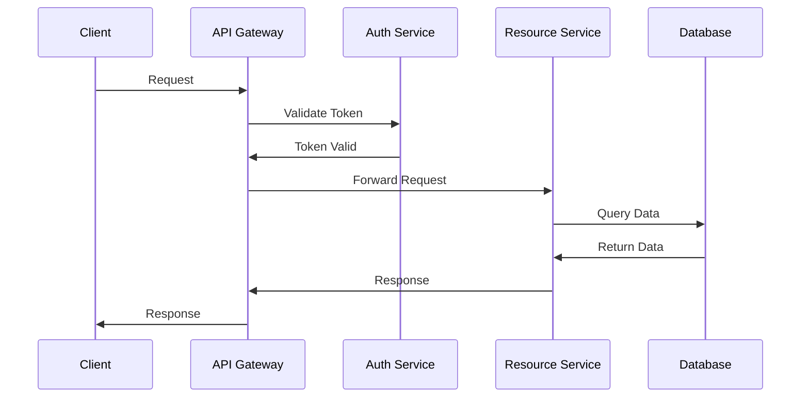

# Documentation Standards

This guide outlines our organization's standards for documenting code, APIs, and projects.

> 📌 **Return to**: [Main Development Guide](../README.md)

## Quick Start

```bash
# Generating API documentation (Python/FastAPI)
poetry run uvicorn app.main:app --reload
# Access OpenAPI docs at http://localhost:8000/docs

# Generating API documentation (Express)
npx swagger-jsdoc -d swaggerDef.js -o swagger.json
npx swagger-ui-express

# Generate documentation from docstrings (Python)
poetry add sphinx
sphinx-quickstart docs

# Generate documentation from JSDoc (JavaScript)
npm install --save-dev jsdoc
jsdoc src -r -d docs
```

## Project Documentation

### README.md Structure

Every repository must include a well-structured README.md with:

1. **Project Overview**
    - Project name and description
    - Purpose and goals
    - Technologies used
    - Status (development, production, etc.)

2. **Getting Started**
    - Prerequisites
    - Installation steps
    - Configuration
    - Running the application

3. **Development**
    - Development environment setup
    - Testing
    - Linting and code style
    - Contribution workflow

4. **API Documentation**
    - How to access API documentation
    - Overview of main endpoints
    - Authentication requirements

5. **Deployment**
    - Deployment process
    - Environment configuration
    - Required infrastructure

Here's an example README.md template:

````markdown
# Project Name

Brief description of the project, its purpose, and key features.

## Technologies

- Backend: FastAPI, PostgreSQL
- Frontend: Next.js, Tailwind CSS
- Deployment: AWS, Terraform

## Getting Started

### Prerequisites

- Python 3.11+
- Node.js 18+
- Docker and Docker Compose

### Installation

1. Clone the repository:
   ```bash
   git clone git@github.com:organization/project-name.git
   cd project-name
   ```

2. Set up the backend:
   ```bash
   cd backend
   poetry install
   cp .env.example .env.local
   # Update .env.local with your local settings
   ```

3. Set up the frontend:
   ```bash
   cd frontend
   npm install
   cp .env.example .env.local
   # Update .env.local with your local settings
   ```

### Running Locally

1. Start the backend:
   ```bash
   cd backend
   poetry run uvicorn app.main:app --reload
   ```

2. Start the frontend:
   ```bash
   cd frontend
   npm run dev
   ```

3. Access the application:
   - Frontend: http://localhost:3000
   - Backend API: http://localhost:8000
   - API Documentation: http://localhost:8000/docs

## Development

### Git Workflow

1. Create a feature branch from `development`:
   ```bash
   git checkout development
   git pull
   git checkout -b feature/your-feature-name
   ```

2. Make your changes, commit, and push:
   ```bash
   git add .
   git commit -m "Descriptive commit message"
   git push -u origin feature/your-feature-name
   ```

3. Create a Pull Request to the `development` branch

### Testing

Run backend tests:
```bash
cd backend
poetry run pytest
```

Run frontend tests:
```bash
cd frontend
npm test
```

## API Documentation

API documentation is available at:
- Development: http://localhost:8000/docs
- Staging: https://api.staging.example.com/docs
- Production: https://api.example.com/docs

## Deployment

### Staging Deployment

Deployments to staging are automated when changes are merged to the `development` branch.

### Production Deployment

Production deployments require:
1. A Pull Request from `development` to `main`
2. Approval from at least one team lead
3. Successful CI/CD checks

After merging to `main`, the deployment will happen automatically.
````

### Architecture Documentation

For complex projects, include an `ARCHITECTURE.md` file:

````markdown
# Project Architecture

This document outlines the architecture of the system, including components, data flow, and key design decisions.

## System Overview

[Include a high-level diagram of the system architecture]

The system consists of the following components:
- Frontend: Next.js web application
- Backend API: FastAPI service
- Authentication Service: Handles user authentication
- Database: PostgreSQL for persistent storage
- Cache: Redis for performance optimization

## Data Flow

1. User requests come to the frontend application
2. Frontend makes API requests to the backend
3. Backend validates requests through the authentication service
4. Backend performs business logic and database operations
5. Response flows back to the user

## Component Details

### Frontend

- Framework: Next.js with TypeScript
- State Management: React Context API and SWR
- Styling: Tailwind CSS
- Deployment: Vercel

### Backend API

- Framework: FastAPI
- Database ORM: SQLAlchemy
- Authentication: JWT tokens
- Deployment: AWS Lambda

### Database

- Engine: PostgreSQL 14
- Access: Through SQLAlchemy ORM
- Migrations: Alembic

## Security Considerations

- Authentication: JWT with short expiry and refresh tokens
- Authorization: Role-based access control
- API Security: Rate limiting, CORS, input validation
- Data Protection: Encryption at rest and in transit

## Scalability

- Horizontal scaling through containerization
- Database read replicas for scaling read operations
- Caching layer for frequently accessed data
````

### Contributing Guide

Include a `CONTRIBUTING.md` file:

````markdown
# Contributing Guide

Thank you for considering contributing to this project! This document outlines the process for contributing.

## Code of Conduct

Please follow our [Code of Conduct](CODE_OF_CONDUCT.md) in all your interactions with the project.

## How Can I Contribute?

### Reporting Bugs

- Check if the bug has already been reported
- Use the bug report template
- Include detailed steps to reproduce
- Include relevant logs and screenshots

### Suggesting Features

- Check if the feature has already been suggested
- Use the feature request template
- Explain the use case and benefits

### Pull Requests

1. Fork the repository
2. Create a feature branch: `git checkout -b feature/your-feature-name`
3. Make your changes
4. Run tests and linting: `npm test && npm run lint`
5. Commit your changes: `git commit -m "Add feature X"`
6. Push to your fork: `git push origin feature/your-feature-name`
7. Create a Pull Request against the `development` branch

## Development Workflow

### Setup Development Environment

Follow the instructions in the [README.md](README.md) file.

### Coding Standards

- Follow the established code style
- Write unit tests for new features
- Update documentation

### Commit Messages

- Use clear and descriptive commit messages
- Reference issue numbers: "Fix #123: Add validation for email field"
- Use present tense: "Add feature" not "Added feature"

### Pull Request Process

1. Update the README.md with details of changes if needed
2. Update documentation for new features
3. The PR must pass all CI checks
4. The PR must be reviewed by at least one maintainer
5. Squash your commits before merging

## Documentation

- Update README.md for user-facing changes
- Update inline documentation for code changes
- Update API documentation for API changes
````

## Code Documentation

### Python Code Documentation

Use Google-style docstrings:

```python
def calculate_total(items: list[Item], tax_rate: float) -> float:
    """
    Calculate the total price including tax.

    Args:
        items: List of items to calculate total for
        tax_rate: Tax rate as a decimal (e.g., 0.07 for 7%)

    Returns:
        Total price including tax
        
    Raises:
        ValueError: If tax_rate is negative
    """
    if tax_rate < 0:
        raise ValueError("Tax rate cannot be negative")
    
    subtotal = sum(item.price for item in items)
    return subtotal * (1 + tax_rate)

class Order:
    """
    Represents a customer order.
    
    Attributes:
        id: Unique identifier for the order
        customer_id: Identifier for the customer
        items: List of items in the order
        created_at: When the order was created
    """

    def __init__(self, customer_id: str, items: list[Item]):
        """
        Initialize a new order.
        
        Args:
            customer_id: Identifier for the customer
            items: List of items to include in the order
        """
        self.id = str(uuid.uuid4())
        self.customer_id = customer_id
        self.items = items
        self.created_at = datetime.now()
```

### JavaScript/TypeScript Code Documentation

Use JSDoc comments:

```javascript
/**
 * Calculate the total price including tax
 * 
 * @param {Array<Item>} items - List of items to calculate total for
 * @param {number} taxRate - Tax rate as a decimal (e.g., 0.07 for 7%)
 * @returns {number} Total price including tax
 * @throws {Error} If taxRate is negative
 */
function calculateTotal(items, taxRate) {
  if (taxRate < 0) {
    throw new Error('Tax rate cannot be negative');
  }
  
  const subtotal = items.reduce((sum, item) => sum + item.price, 0);
  return subtotal * (1 + taxRate);
}

/**
 * Represents a customer order
 */
class Order {
  /**
   * ID of the order
   * @type {string}
   */
  id;
  
  /**
   * ID of the customer
   * @type {string}
   */
  customerId;
  
  /**
   * Items in the order
   * @type {Array<Item>}
   */
  items;
  
  /**
   * When the order was created
   * @type {Date}
   */
  createdAt;
  
  /**
   * Create a new order
   * 
   * @param {string} customerId - ID of the customer
   * @param {Array<Item>} items - Items to include in the order
   */
  constructor(customerId, items) {
    this.id = crypto.randomUUID();
    this.customerId = customerId;
    this.items = items;
    this.createdAt = new Date();
  }
}
```

## API Documentation

### REST API Documentation

#### OpenAPI Specification

Use OpenAPI/Swagger for documenting REST APIs:

```yaml
# openapi.yaml
openapi: 3.0.0
info:
  title: Project API
  description: API for managing projects
  version: 1.0.0
servers:
  - url: https://api.example.com/v1
paths:
  /projects:
    get:
      summary: List projects
      description: Returns a list of projects
      parameters:
        - name: limit
          in: query
          description: Maximum number of projects to return
          schema:
            type: integer
            default: 20
      responses:
        '200':
          description: A list of projects
          content:
            application/json:
              schema:
                type: array
                items:
                  $ref: '#/components/schemas/Project'
    post:
      summary: Create a project
      description: Creates a new project
      requestBody:
        required: true
        content:
          application/json:
            schema:
              $ref: '#/components/schemas/ProjectInput'
      responses:
        '201':
          description: Created project
          content:
            application/json:
              schema:
                $ref: '#/components/schemas/Project'
components:
  schemas:
    Project:
      type: object
      properties:
        id:
          type: string
          format: uuid
        name:
          type: string
        description:
          type: string
        status:
          type: string
          enum: [active, archived, completed]
      required:
        - id
        - name
        - status
    ProjectInput:
      type: object
      properties:
        name:
          type: string
        description:
          type: string
      required:
        - name
```

#### FastAPI Example

FastAPI automatically generates OpenAPI documentation from your code:

```python
from fastapi import FastAPI, HTTPException, Path, Query
from pydantic import BaseModel
from typing import List, Optional
from uuid import UUID, uuid4

app = FastAPI(
    title="Project API",
    description="API for managing projects",
    version="1.0.0",
)

class ProjectInput(BaseModel):
    name: str
    description: Optional[str] = None

class Project(BaseModel):
    id: UUID
    name: str
    description: Optional[str] = None
    status: str

# In-memory database
projects_db = {}

@app.get("/projects", response_model=List[Project], tags=["Projects"])
async def list_projects(
    limit: int = Query(20, description="Maximum number of projects to return"),
):
    """
    List all projects.
    
    Returns a list of projects with pagination support.
    """
    return list(projects_db.values())[:limit]

@app.post("/projects", response_model=Project, status_code=201, tags=["Projects"])
async def create_project(project: ProjectInput):
    """
    Create a new project.
    
    Returns the created project with its assigned ID.
    """
    project_id = uuid4()
    new_project = Project(
        id=project_id,
        name=project.name,
        description=project.description,
        status="active",
    )
    projects_db[project_id] = new_project
    return new_project
```

#### Express Example

Use Swagger JSDoc for Express APIs:

```javascript
/**
 * @swagger
 * /projects:
 *   get:
 *     summary: List projects
 *     description: Returns a list of projects
 *     parameters:
 *       - in: query
 *         name: limit
 *         schema:
 *           type: integer
 *           default: 20
 *         description: Maximum number of projects to return
 *     responses:
 *       200:
 *         description: A list of projects
 *         content:
 *           application/json:
 *             schema:
 *               type: array
 *               items:
 *                 $ref: '#/components/schemas/Project'
 */
router.get('/projects', (req, res) => {
  const limit = parseInt(req.query.limit) || 20;
  const projects = Object.values(projectsDb).slice(0, limit);
  res.json(projects);
});

/**
 * @swagger
 * /projects:
 *   post:
 *     summary: Create a project
 *     description: Creates a new project
 *     requestBody:
 *       required: true
 *       content:
 *         application/json:
 *           schema:
 *             $ref: '#/components/schemas/ProjectInput'
 *     responses:
 *       201:
 *         description: Created project
 *         content:
 *           application/json:
 *             schema:
 *               $ref: '#/components/schemas/Project'
 */
router.post('/projects', (req, res) => {
  const { name, description } = req.body;
  
  const projectId = uuid();
  const newProject = {
    id: projectId,
    name,
    description,
    status: 'active',
  };
  
  projectsDb[projectId] = newProject;
  res.status(201).json(newProject);
});

/**
 * @swagger
 * components:
 *   schemas:
 *     Project:
 *       type: object
 *       properties:
 *         id:
 *           type: string
 *           format: uuid
 *         name:
 *           type: string
 *         description:
 *           type: string
 *         status:
 *           type: string
 *           enum: [active, archived, completed]
 *       required:
 *         - id
 *         - name
 *         - status
 *     ProjectInput:
 *       type: object
 *       properties:
 *         name:
 *           type: string
 *         description:
 *           type: string
 *       required:
 *         - name
 */
```

### GraphQL API Documentation

Use GraphQL SDL (Schema Definition Language) with descriptions:

```graphql
"""
A project in the system
"""
type Project {
  """
  Unique identifier for the project
  """
  id: ID!
  
  """
  Name of the project
  """
  name: String!
  
  """
  Optional description of the project
  """
  description: String
  
  """
  Current status of the project
  """
  status: ProjectStatus!
  
  """
  Tasks associated with this project
  """
  tasks: [Task!]!
}

"""
Status options for a project
"""
enum ProjectStatus {
  ACTIVE
  ARCHIVED
  COMPLETED
}

"""
Input for creating a new project
"""
input CreateProjectInput {
  """
  Name of the project
  """
  name: String!
  
  """
  Optional description of the project
  """
  description: String
}

type Query {
  """
  Get a list of projects
  
  @param limit Maximum number of projects to return
  """
  projects(limit: Int = 20): [Project!]!
  
  """
  Get a single project by ID
  
  @param id ID of the project to retrieve
  """
  project(id: ID!): Project
}

type Mutation {
  """
  Create a new project
  
  @param input Project creation input
  @returns The created project
  """
  createProject(input: CreateProjectInput!): Project!
  
  """
  Update an existing project
  
  @param id ID of the project to update
  @param input Project update input
  @returns The updated project
  """
  updateProject(id: ID!, input: UpdateProjectInput!): Project!
}
```

## Technical Documentation

### Architecture Diagrams

Use standard diagram types:

1. **C4 Model** for system architecture:
    - Level 1: System Context Diagram
    - Level 2: Container Diagram
    - Level 3: Component Diagram
    - Level 4: Code Diagram

2. **Sequence Diagrams** for process flows

3. **Entity-Relationship Diagrams** for database design

Tools:
- [PlantUML](https://plantuml.com/) - Text-based diagram creation
- [Mermaid](https://mermaid-js.github.io/mermaid/) - JavaScript-based diagram generation
- [Lucidchart](https://www.lucidchart.com/) - Visual diagram editor

Example Mermaid diagram:

````markdown

````

### Design Documents

Include design documents for major features:

````markdown
# Feature Design: User Authentication System

## Overview
This document outlines the design for the user authentication system.

## Goals
- Secure user authentication
- Support OAuth2 providers (Google, GitHub)
- Implement JWT-based session management
- Provide password reset functionality

## Non-Goals
- User management (separate feature)
- Role-based authorization (separate feature)

## Design

### Authentication Flow
1. User provides credentials (username/password or OAuth2)
2. System validates credentials
3. System generates JWT token
4. System returns token to client
5. Client includes token in subsequent requests

### Components
- Authentication API (FastAPI)
- Token Service (JWT generation and validation)
- User Repository (Database access)
- OAuth2 Clients (Google, GitHub)

### API Endpoints
- POST /auth/login - Username/password login
- POST /auth/refresh - Refresh expired token
- GET /auth/providers - List available OAuth2 providers
- GET /auth/oauth/{provider} - Initiate OAuth2 flow
- GET /auth/oauth/{provider}/callback - OAuth2 callback

### Data Models
```
User {
  id: UUID
  email: string
  password_hash: string (optional)
  oauth_provider: string (optional)
  oauth_id: string (optional)
}

Token {
  access_token: string
  refresh_token: string
  token_type: string
  expires_in: number
}
```

### Security Considerations
- Password hashing with bcrypt
- Short-lived JWT tokens (15 minutes)
- Refresh tokens with rotation
- HTTPS for all endpoints
- Rate limiting for login attempts

## Implementation Plan
1. Database schema for users
2. Authentication API endpoints
3. JWT token service
4. Password login flow
5. OAuth2 integration
6. Refresh token flow
7. Password reset flow

## Testing Plan
- Unit tests for token service
- Integration tests for API endpoints
- End-to-end tests for authentication flows
````

## Automating Documentation

### Sphinx for Python Projects

```bash
# Install Sphinx
poetry add --dev sphinx sphinx-rtd-theme

# Initialize Sphinx
cd docs
sphinx-quickstart

# Generate documentation
cd ..
sphinx-build -b html docs/source docs/build
```

Configure `docs/source/conf.py`:

```python
# Add autodoc extension
extensions = [
    'sphinx.ext.autodoc',
    'sphinx.ext.viewcode',
    'sphinx.ext.napoleon',
]

# Set up theme
html_theme = 'sphinx_rtd_theme'

# Configure autodoc
autodoc_member_order = 'bysource'
autodoc_typehints = 'description'
```

### JSDoc for JavaScript Projects

```bash
# Install JSDoc
npm install --save-dev jsdoc

# Add JSDoc configuration (jsdoc.json)
{
  "source": {
    "include": ["src"],
    "includePattern": ".+\\.js(x)?$",
    "excludePattern": "(node_modules/|docs)"
  },
  "plugins": ["plugins/markdown"],
  "templates": {
    "cleverLinks": false,
    "monospaceLinks": false
  },
  "opts": {
    "destination": "./docs",
    "recurse": true,
    "readme": "./README.md"
  }
}

# Add script to package.json
"scripts": {
  "docs": "jsdoc -c jsdoc.json"
}

# Generate documentation
npm run docs
```

## Documentation Review Process

1. **Automated Checks**:
    - Check for undocumented public functions
    - Validate code examples
    - Check for broken links

2. **Peer Reviews**:
    - Include documentation in code reviews
    - Use a documentation-specific checklist

3. **User Testing**:
    - Have team members follow documentation
    - Collect feedback from new team members

## Documentation Checklist

Use this checklist for documentation reviews:

- [ ] Does the README provide a clear overview of the project?
- [ ] Are installation and setup instructions complete and accurate?
- [ ] Are all public APIs documented?
- [ ] Do code examples work as expected?
- [ ] Is the documentation up-to-date with the latest code changes?
- [ ] Are there any unclear or ambiguous sections?
- [ ] Does the documentation follow the established standards?
- [ ] Are there architecture diagrams for complex components?
- [ ] Is there a CONTRIBUTING.md file for new contributors?
- [ ] Is the documentation accessible (clear language, good formatting)?

## Maintaining Documentation

### Versioning Documentation

For libraries and APIs:
- Version documentation alongside code
- Include change logs for each version
- Archive documentation for older versions

### Deprecation Notices

When deprecating features:
- Clearly mark deprecated features in documentation
- Provide migration paths to new features
- Set expectations for when features will be removed

Example:

```python
def old_function():
    """
    Calculate something important.
    
    Deprecated:
        This function is deprecated and will be removed in version 2.0.0.
        Use `new_function()` instead.
    """
    warnings.warn(
        "old_function is deprecated, use new_function instead",
        DeprecationWarning,
        stacklevel=2,
    )
    return new_function()
```

```javascript
/**
 * Calculate something important.
 * 
 * @deprecated This function is deprecated and will be removed in version 2.0.0.
 * Use `newFunction()` instead.
 */
function oldFunction() {
  console.warn('oldFunction is deprecated, use newFunction instead');
  return newFunction();
}
```