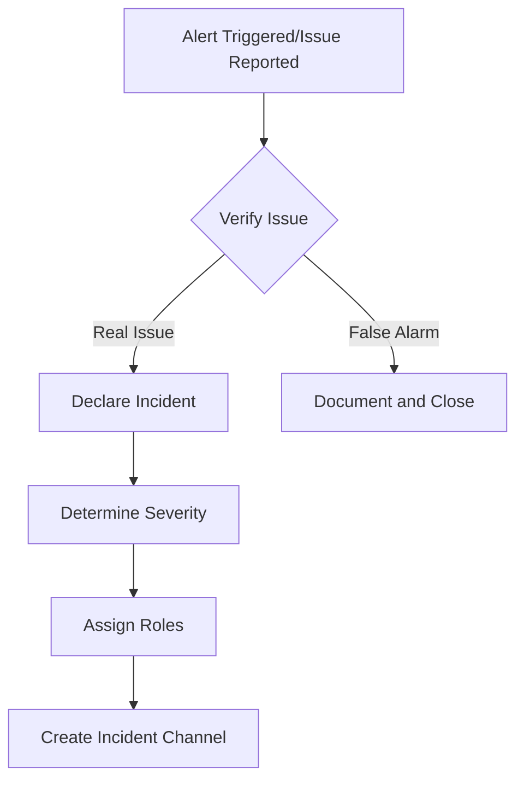
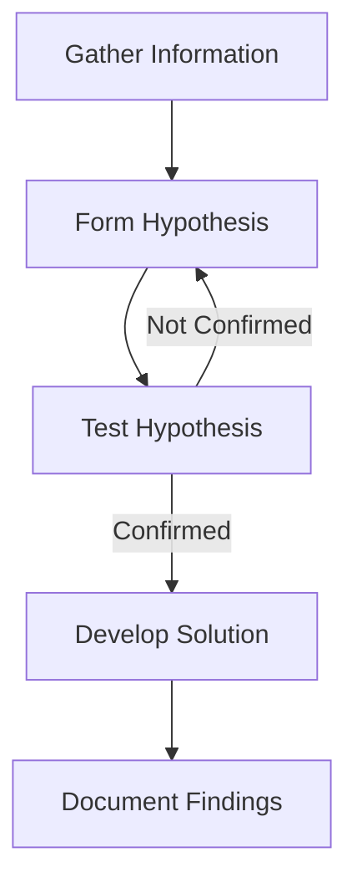
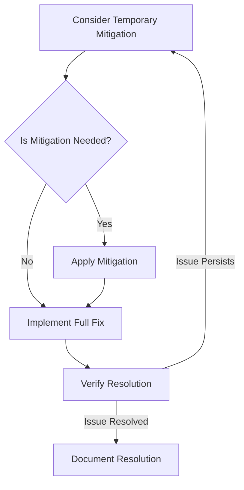

# Production Incident Response

This guide outlines our organization's standards for responding to and resolving production incidents quickly and effectively.

> 📌 **Return to**: [Main Development Guide](README.md)

## Incident Response Overview

A well-defined incident response process is critical for minimizing the impact of production issues. After a particularly painful 6-hour outage in our payment system last year that could have been resolved in minutes with proper procedures, we've established this comprehensive framework.

```
┌─────────────────┐     ┌─────────────────┐     ┌─────────────────┐
│                 │     │                 │     │                 │
│    Detection    │ ──► │  Classification │ ──► │    Response     │
│                 │     │                 │     │                 │
└─────────────────┘     └─────────────────┘     └─────────────────┘
                                                        │
┌─────────────────┐     ┌─────────────────┐            │
│                 │     │                 │            │
│ Post-Incident   │ ◄── │   Resolution    │ ◄──────────┘
│    Review       │     │                 │
│                 │     │                 │
└─────────────────┘     └─────────────────┘
```

## Incident Severity Levels

We classify incidents by severity to ensure appropriate response:

| Level | Name | Description | Examples | Response Time | Resolution Target |
|-------|------|-------------|----------|---------------|-------------------|
| P1 | **Critical** | Service down or unusable with major business impact | - Payment processing failure<br>- Complete site outage<br>- Data breach | Immediate | < 2 hours |
| P2 | **Major** | Partial service disruption with significant impact | - Checkout slowness<br>- Important feature unavailable<br>- Major performance degradation | < 30 min | < 4 hours |
| P3 | **Minor** | Minor feature issues with limited impact | - Non-critical feature unavailable<br>- UI/UX bugs<br>- Isolated errors | < 2 hours | < 24 hours |
| P4 | **Low** | Cosmetic issues or improvements | - Visual glitches<br>- Minor performance issues<br>- Documentation errors | Next business day | < 1 week |

## Incident Roles and Responsibilities

For P1 and P2 incidents, we assign specific roles:

### Incident Commander (IC)

The IC coordinates the response effort:
- Declares the incident
- Assigns roles
- Makes critical decisions
- Coordinates communication
- Ensures follow-up actions

### Technical Lead

The Technical Lead directs the technical response:
- Leads troubleshooting
- Coordinates technical resources
- Makes technical decisions
- Implements or oversees fixes
- Documents technical details

### Communications Lead

The Communications Lead manages internal and external communications:
- Updates status page
- Notifies stakeholders
- Drafts customer communications
- Coordinates with support team
- Documents timeline

### Scribe

The Scribe documents all aspects of the incident:
- Maintains real-time incident log
- Records key decisions and findings
- Captures action items
- Compiles information for post-mortem
- Ensures documentation is complete

## Incident Detection

Effective detection systems help us identify issues quickly:

### Monitoring Systems

We use multiple monitoring layers:
- **Infrastructure Monitoring**: CPU, memory, disk usage, network
- **Application Monitoring**: Error rates, response times, request volumes
- **Business Metrics**: Conversion rates, order volumes, user signups
- **Synthetic Monitoring**: Simulated user journeys

### Alert Thresholds

Standardized alert thresholds based on service criticality:
- **Critical Services**: 99.9% availability, < 200ms response time
- **Important Services**: 99.5% availability, < 500ms response time
- **Standard Services**: 99% availability, < 1s response time

### On-Call Rotation

We maintain a 24/7 on-call rotation:
- Primary and secondary on-call engineers
- Weekly rotation schedule
- Escalation paths for each service
- Response time SLAs by severity

## Incident Response Process

### 1. Detection and Declaration

When an incident is detected:



1. **Alert triggered** or issue reported
2. **Verify the issue** is real and impacting users
3. **Declare the incident** in the #incidents Slack channel
4. **Determine severity** based on impact criteria
5. **Assign roles** based on severity and availability
6. **Create incident channel** (e.g., #inc-2023-04-25-payment-api)

We've found that formally declaring incidents speeds up response by 40% compared to our previous ad-hoc approach.

### 2. Investigation and Diagnosis

Steps for investigating the issue:



1. **Gather information**:
    - What changed recently?
    - Which components are affected?
    - What errors are appearing?
    - When did it start?

2. **Form hypotheses** about potential causes
3. **Test hypotheses** with data and investigation
4. **Develop solution** once root cause is identified
5. **Document findings** for transparency

#### Investigation Checklist

- [ ] Review recent deployments and changes
- [ ] Check error logs and monitoring dashboards
- [ ] Verify infrastructure status (AWS, GCP, etc.)
- [ ] Check dependent service status
- [ ] Review recent configuration changes
- [ ] Analyze affected user segments

### 3. Mitigation and Resolution

Steps for resolving the incident:



1. **Consider temporary mitigation** to restore service:
    - Feature flags to disable problematic features
    - Rollback to previous version
    - Increase resources temporarily
    - Circuit breakers or rate limiting

2. **Implement full fix** once available
3. **Verify resolution** with monitoring and testing
4. **Document resolution** steps taken

Our rollback-vs-fix protocol saved us during a critical checkout issue when a quick rollback restored service while the team developed a proper fix.

### 4. Communication

Maintain clear communication throughout the incident:

#### Internal Communication

- Post regular updates in the incident Slack channel
- Hold brief status update calls for critical incidents
- Document current status, findings, and next steps
- Ensure all team members have a shared understanding

#### External Communication

For user-impacting incidents:

- Update status page promptly
- Prepare customer communication if needed
- Coordinate with support team
- Set realistic expectations for resolution
- Acknowledge the issue without overpromising

#### Status Updates Template

```
Incident: [Brief description]
Status: [Investigating/Mitigating/Resolved]
Time: [Current time]

What we know:
- [Facts about the incident]

What we're doing:
- [Current actions being taken]

Next update expected by:
- [Time for next update]
```

## Post-Incident Activities

### 1. Immediate Follow-up

Tasks to complete immediately after resolution:

1. **Verify stability** of the fix
2. **Document incident details** in the incident log
3. **Notify all stakeholders** of resolution
4. **Schedule post-mortem** meeting
5. **Create follow-up tickets** for any technical debt

### 2. Post-Mortem Analysis

Conduct a blameless post-mortem:

1. **Meeting**: Schedule within 2 business days
2. **Participants**: Include incident responders and stakeholders
3. **Format**: Follow structured template
4. **Documentation**: Create detailed post-mortem document
5. **Action Items**: Assign owners and deadlines

#### Post-Mortem Template

```markdown
# Incident Post-Mortem: [Incident Title]

## Overview
- **Date and Time**: [Start and end times]
- **Duration**: [Total time]
- **Severity**: [P1/P2/P3/P4]
- **Services Affected**: [List of affected services]
- **Customer Impact**: [Description of user impact]

## Timeline
- **[Time]**: [Event description]
- **[Time]**: [Event description]
- ...

## Root Cause
[Detailed explanation of what caused the incident]

## Detection
- How was the incident detected?
- Was there a delay in detection? Why?
- Could we have detected it earlier?

## Response
- What went well in our response?
- What could have been improved?
- Were the right people involved?

## Resolution
- How was the incident resolved?
- Were there alternative approaches considered?
- Is the resolution temporary or permanent?

## Lessons Learned
- [Key insight 1]
- [Key insight 2]
- ...

## Action Items
| Action | Owner | Due Date | Status |
|--------|-------|----------|--------|
| [Description] | [Name] | [Date] | [Status] |
| ... | ... | ... | ... |
```

### 3. Implementation of Improvements

Convert lessons learned into concrete improvements:

1. **Technical Fixes**: Address underlying issues
2. **Monitoring Improvements**: Enhance detection capabilities
3. **Process Updates**: Refine incident response procedures
4. **Documentation**: Update runbooks and knowledge base
5. **Training**: Share learnings with the wider team

We track action item completion rates as a KPI for our incident response program, with a target of 90% completion within the assigned timeframe.

## Incident Response Tools

### Essential Tools

1. **Slack**: Primary communication channel
2. **PagerDuty**: On-call management and alerting
3. **Statuspage**: External status communication
4. **Zoom**: Video conferencing for critical incidents
5. **Jira**: Ticket tracking for follow-up actions
6. **Google Docs**: Collaborative documentation
7. **Runbooks**: Service-specific troubleshooting guides

### Incident Command Center

For P1 incidents, we activate our Incident Command Center:

1. **Dedicated Zoom Room**: Always-on video conference
2. **Live Dashboard**: Real-time monitoring display
3. **Shared Document**: Collaborative incident notes
4. **Status Board**: Current status and action items
5. **Timeline Display**: Chronological event tracking

## Incident Prevention

### Preventative Practices

1. **Change Management**:
    - Risk assessment for all changes
    - Staged deployments
    - Automatic rollback capabilities

2. **Testing Practices**:
    - Comprehensive test coverage
    - Load and stress testing
    - Chaos engineering

3. **Architecture Improvements**:
    - Circuit breakers
    - Rate limiting
    - Graceful degradation
    - Redundancy for critical components

### Chaos Engineering

Regular controlled testing of failure scenarios:

1. **Game Days**: Simulated incidents with team response
2. **Chaos Experiments**: Controlled failure injection
3. **Disaster Recovery Testing**: Regular DR exercises
4. **Tabletop Exercises**: Team discussions of hypothetical scenarios

These exercises reduced our meantime to recovery (MTTR) by 35% by familiarizing teams with emergency procedures.

## Lessons Learned from Major Incidents

### Payment Processing Outage (April 2023)

**Situation**: A database connection pool exhaustion caused a 45-minute payment processing outage.

**Key Learnings**:
1. Connection pool monitoring was insufficient
2. Retry storms amplified the initial issue
3. Fallback payment pathway was not automatically activated
4. Customer communication was delayed

**Improvements Made**:
1. Added detailed connection pool monitoring
2. Implemented exponential backoff for retries
3. Automated failover to backup payment processor
4. Created pre-approved communication templates

### API Rate Limiting Incident (July 2023)

**Situation**: A misconfigured rate limit blocked legitimate traffic from major customers.

**Key Learnings**:
1. Rate limit changes needed better testing
2. Monitoring didn't differentiate rejected vs. failed requests
3. Customer-specific limits weren't clearly documented
4. Rollback process was too slow

**Improvements Made**:
1. Created test suite for rate limit configuration
2. Added specific monitoring for rate-limited requests
3. Documented customer limits in service catalog
4. Implemented one-click rollback for rate limit changes

### Authentication Service Degradation (October 2023)

**Situation**: Gradual performance degradation in the authentication service over several days.

**Key Learnings**:
1. Slow degradation wasn't triggering alerts
2. Root cause (memory leak) was difficult to diagnose
3. No recent performance baseline to compare against
4. Multiple teams made uncoordinated changes

**Improvements Made**:
1. Added trend-based alerting for gradual degradation
2. Improved memory profiling and leak detection
3. Established regular performance benchmarking
4. Enhanced change coordination between teams

## Continuous Improvement

Regular review and enhancement of our incident response system:

1. **Monthly Metrics Review**:
    - Mean Time To Detect (MTTD)
    - Mean Time To Resolve (MTTR)
    - Incident frequency by type
    - Action item completion rate

2. **Quarterly Process Review**:
    - Review and update incident response procedures
    - Enhance runbooks based on recent incidents
    - Identify process gaps and improvements

3. **Annual Simulation Exercise**:
    - Full-scale incident simulation
    - Cross-team coordination practice
    - Executive team involvement
    - Comprehensive process evaluation

We've reduced our average resolution time for P1 incidents by 62% since implementing this continuous improvement framework.